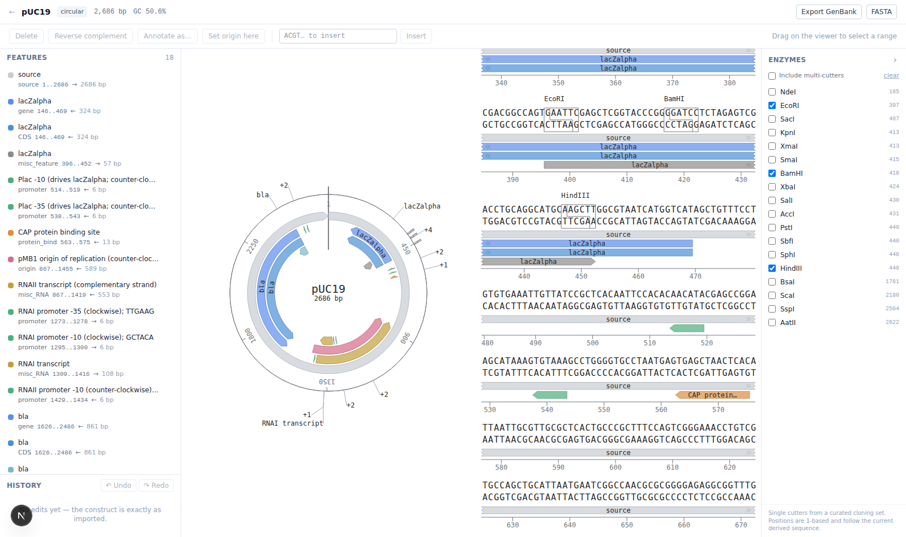
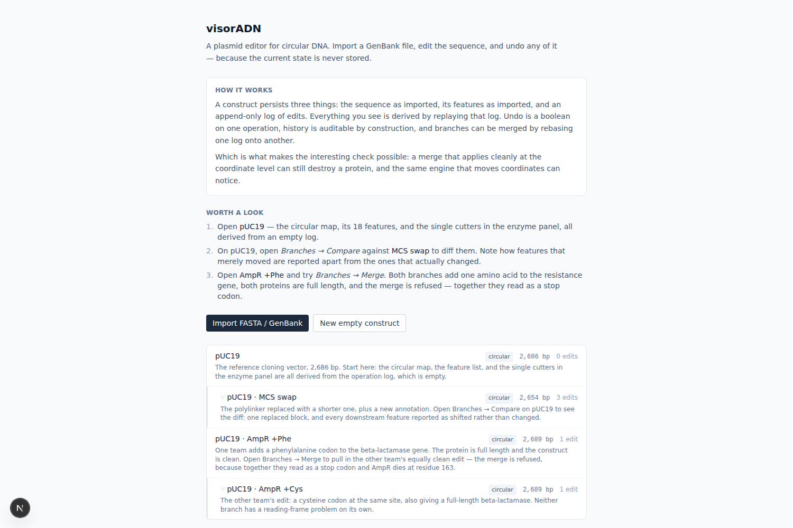
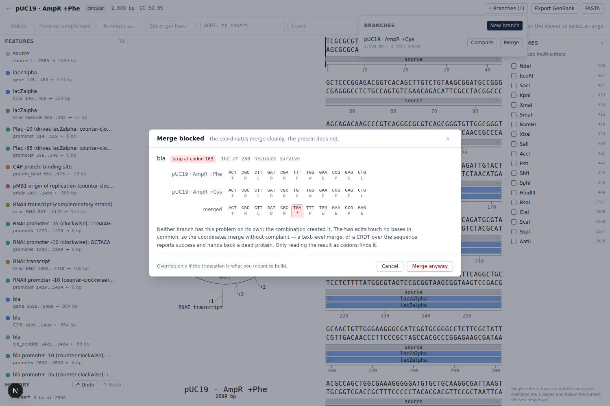
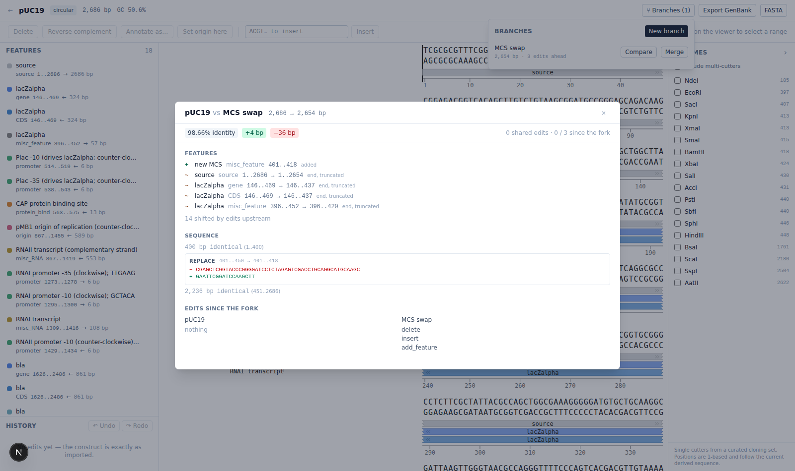

# visorADN

A web editor for circular DNA sequences (plasmids, 2–20 kb): import GenBank or
FASTA, view the circular and linear maps side by side, edit the sequence, and
undo any of it. Portfolio project, not a clinical tool.



- **Backend** — Python 3.11, FastAPI, Pydantic v2, Biopython, SQLAlchemy 2 + SQLite
- **Frontend** — Next.js 15 (App Router), TypeScript, Tailwind 4, [`seqviz`](https://github.com/Lattice-Automation/seqviz)

---

## The idea: current state is derived, never stored

This is the part worth understanding first, because everything else follows
from it.

A construct persists exactly three things:

```
base_sequence     the sequence as it was imported, never mutated
base_features     the features as they were imported, never mutated
operations[]      an append-only, ordered log of edits
```

The sequence you see on screen is not in the database. It is computed on every
read by folding the log over the base:

```python
# backend/app/domain/replay.py
def replay(base_seq, base_features, ops, *, is_circular=True) -> ConstructState
```

`replay()` is a pure function — no I/O, no FastAPI, no SQLAlchemy — so the
interesting logic is testable in isolation, and it is where every coordinate
rule lives.

**Why bother?** Three things fall out for free:

1. **Undo is a boolean.** `POST /undo` flips `reverted = true` on the last live
   operation. The next read simply skips it. Nothing is recomputed by hand and
   nothing can drift, because there is no stored state to drift from. Redo
   flips it back.
2. **The history is auditable.** `GET /history` is the literal list of edits,
   including the undone ones. Nothing is lost to an in-place mutation.
3. **The rebasing rules have exactly one home.** Every coordinate shift lives in
   `replay.py` and is exercised by unit tests that never touch a database.

The one thing to be careful about: applying a new operation while some are
undone **deletes** the undone ones. That is text-editor semantics, not git —
there is no branching history.

```
ops:  [0 insert] [1 delete] [2 revcomp]
undo x2                     ↓ reverted    ↓ reverted
apply "insert"              ✗ deleted     ✗ deleted   [1 insert]  ← new
```

### Operations

| kind             | payload                    | notes                                     |
|------------------|----------------------------|-------------------------------------------|
| `insert`         | `{pos, seq}`               |                                           |
| `delete`         | `{start, end}`             |                                           |
| `replace`        | `{start, end, seq}`        | implemented as delete + insert            |
| `revcomp_region` | `{start, end}`             |                                           |
| `add_feature`    | `{feature}`                |                                           |
| `remove_feature` | `{feature_id}`             |                                           |
| `update_feature` | `{feature_id, patch}`      |                                           |
| `set_origin`     | `{pos}`                    | rotates a circular construct              |

---

## Coordinates

0-based, `start` inclusive, `end` exclusive — Python slice semantics.

On a **circular** construct an interval may cross the origin, in which case
`start > end` (e.g. `start=4900, end=120` on a 5000 bp plasmid). `start == end`
means the whole molecule. Zero-length features are rejected.

### How rebasing works

Every length-changing edit moves the features after it. The rules, all covered
one-by-one in `tests/test_rebasing.py`:

**insert at `pos`** — one endpoint rule handles every case, wraparound included:

- `start` moves when `start >= pos` (the insert lands before the feature)
- `end` moves when `end > pos` (the insert lands before the feature's last base)

A feature that strictly contains `pos` therefore keeps its start and grows its
end: it swallows the inserted bases.

**delete `[start, end)`**

- feature entirely inside the range → dropped, with a warning
- feature entirely downstream → both endpoints move back
- feature partially overlapped → clipped to the border and flagged `truncated`

**revcomp_region `[start, end)`** — contained features flip strand and mirror
within the range (`new_start = start + (end - old_end)`). A feature that only
partially overlaps the range is left untouched and reported as a warning: there
is no honest single interval for it afterwards.

**set_origin(pos)** — every coordinate moves by `-pos` modulo the length.

### Wraparound is handled by decomposition, not special cases

A possibly-wrapping interval is split into its one or two **linear** segments
(`circular.py: segments()`), the plain linear rule runs on each, and the pieces
are rejoined (`recombine()`). That keeps one implementation of each rule
instead of a linear and a circular variant.

Operations whose *range* wraps are handled by rotating the construct so the
range starts at 0, applying the linear operation, and rotating back — so
`revcomp_region(4900, 120)` leaves every base outside the range at exactly the
coordinate it had before.

Pattern and enzyme searches concatenate `seq + seq[:k-1]` and drop hits that
start past the end, so a site spanning the origin is found exactly once.

---

## Running it

Two processes. The backend serves on `:8000`, the frontend on `:3000`.

### Backend

```bash
cd backend
uv sync
uv run uvicorn app.main:app --reload --port 8000
```

Interactive API docs: <http://localhost:8000/docs>.
The SQLite file lands at `backend/visoradn.db`; override with `DATABASE_URL`.

### Frontend

```bash
cd frontend
pnpm install
pnpm dev
```

Then open <http://localhost:3000>.

Point the UI at a different API with `NEXT_PUBLIC_API_BASE_URL`; allow extra
browser origins with `CORS_ORIGINS` on the backend.

### Seed the demo scenarios

```bash
cd backend && uv run python -m app.seed      # --reset to start over
```

Idempotent: running it again restores whatever is missing and leaves the rest
alone. Constructs can be deleted from the listing, and re-seeded from there.



Three things to look at, in order:

1. **pUC19** — 2,686 bp, 18 features, its single cutters in the enzyme panel.
   All derived from an operation log that is empty.
2. **pUC19 → MCS swap** — on pUC19, *Branches → Compare*. One replaced block,
   one added annotation, four genuinely truncated features, and fourteen that
   merely shifted, reported apart.
3. **pUC19 · AmpR +Phe → +Cys** — *Branches → Merge*, and watch it be refused.

The third is the one to read closely. Two teams each insert a single codon
into the beta-lactamase gene at the same site: one adds a phenylalanine, the
other a cysteine. Each branch alone yields a full-length 287-residue protein
with no reading-frame problem. Their inserts are single points, so they cannot
overlap, and both are 3 bp, so neither shifts the frame — a text merge, or a
CRDT over the sequence, reports success.

Merged, the two codons read across a codon boundary as a stop, and AmpR dies
at residue 163 of 289. The merge is refused with a 409 naming the codon.

That pair was found by search rather than by hand — `app/seed.py` records the
positions, and `tests/test_seed.py` asserts that each branch is clean and that
merging them still breaks `bla`, so the demo cannot quietly stop demonstrating
anything.

### Tests

```bash
cd backend && uv run pytest
```

424 tests: one per rebasing rule, explicit wraparound cases, GenBank round
trips against two real pUC19 records, reading-frame integrity, log merging,
diffing, the seeded scenarios, and the HTTP surface end to end.

---

## API

| Method | Path                                | |
|--------|-------------------------------------|-|
| POST   | `/api/constructs`                   | create empty or from a raw sequence |
| POST   | `/api/constructs/import`            | multipart `.fasta` / `.gb` / `.gbk` |
| GET    | `/api/constructs`                   | listing |
| GET    | `/api/constructs/{id}`              | metadata + current derived state |
| DELETE | `/api/constructs/{id}`              | |
| POST   | `/api/constructs/{id}/operations`   | apply one operation |
| POST   | `/api/constructs/{id}/undo`         | |
| POST   | `/api/constructs/{id}/redo`         | |
| GET    | `/api/constructs/{id}/history`      | operations with their `reverted` flag |
| GET    | `/api/constructs/{id}/export`       | `?format=genbank\|fasta` |
| GET    | `/api/constructs/{id}/enzymes`      | `?all=true`, `?names=EcoRI,BamHI` |
| GET    | `/api/constructs/{id}/orfs`         | `?min_length=300` |
| POST   | `/api/constructs/{id}/branch`       | fork, carrying base and history |
| GET    | `/api/constructs/{id}/branches`     | branches and how far ahead each is |
| POST   | `/api/constructs/{id}/merge/preview`| what a merge would do |
| POST   | `/api/constructs/{id}/merge`        | rebase a branch's log onto this one |
| GET    | `/api/constructs/{id}/diff`         | `?against={id}` — sequence, features, operations |

`GET /{id}` returns `sequence`, `features`, `length`, `is_circular`,
`gc_content`, `warnings`, `frame_issues`, `can_undo` and `can_redo`.

Warnings are part of the derived state: they are recomputed on every replay,
so undoing a truncating delete makes its warning disappear along with the
truncation.

`/enzymes` returns single cutters from a curated set of ~57 cloning workhorses
by default; `?all=true` widens to every commercially available enzyme and
includes multi-cutters. `/orfs` scans all six frames with the standard genetic
code (NCBI table 1) and, on a circular construct, finds ORFs that run through
the origin.

---

## Reading-frame integrity

Rebasing coordinates correctly is not the same as keeping a construct
*biologically* valid. Delete one base inside a CDS and every coordinate in the
system stays perfectly consistent — while the protein is gone.

`analysis.check_reading_frames(state)` runs over the derived state and reports
each coding feature that no longer makes a protein:

| problem | severity | |
|---|---|---|
| `frameshift` | error | length is not a multiple of 3 |
| `premature_stop` | error | an in-frame stop before the last codon |
| `no_stop_codon` | warning | the last codon is not a stop |
| `no_start_codon` | info | does not begin ATG/GTG/TTG |

The two `error` cases are marked `blocking`. They appear in `GET /{id}` as
`frame_issues`, and the UI badges the offending feature. Being derived, they
vanish on undo exactly like a truncation flag does.

Deliberately *not* inside `replay()`: replay owns coordinates, this owns
meaning. Keeping them apart is what lets the same function gate a branch merge
over the same derived state - see below.

### Why the origin-crossing case is the whole difficulty

A CDS that wraps the origin has its codons assembled from two segments, and
**the codon straddling position 0 belongs to neither of them**. For a 30 bp CDS
at `[32, 2)` on a 60 bp plasmid, the tail is 28 bases and the head is 2 —
neither is a multiple of 3, though the CDS is perfectly in frame. Any
implementation that translates the segments separately reports a frameshift on
a healthy gene *and* misses a real stop codon spanning the origin.

`coding_sequence()` therefore assembles the whole span first, then reverse
complements it if the feature is on the minus strand, and only then translates.

`tests/test_reading_frame.py` builds its fixtures by construction rather than
from hand-computed coordinates: a CDS with a known protein is placed in a
plasmid, and `set_origin` rotates the molecule until the stop codon's three
bases land on positions 59, 0 and 1. The suite's backbone is a property test
sweeping all 59 non-trivial origins and asserting the verdict never changes —
rotating a plasmid cannot make a gene valid or invalid. Four deliberately
broken implementations (naive slice, per-segment translation, ignored strand,
off-by-one on the terminal stop) were each checked to fail it.

---

## Branching and merging

A branch is just a construct that shares its parent's base and the first
`fork_index` of its operations. That makes every existing endpoint work on it
unchanged - a branch can be viewed, edited, undone and exported like anything
else.

Merging is a **rebase of the operation log**. Because the history is a list of
semantic operations rather than a blob of text, the branch's operations can be
re-expressed against the target's tip:

```
                  ancestor
                 /        \
   target adds  P0 P1     B0 B1  adds branch
                 \        /
         target + P0 P1 + B0' B1'      B' = B rebased through P
```

Rebasing `delete [1000, 1100)` through a preceding `insert(pos=0, 4 bp)` gives
`delete [1004, 1104)` - the same endpoint arithmetic `replay()` uses to move
*features* across an edit, turned ninety degrees to move *operations*.

### Two independent ways a merge can fail

**Coordinate conflicts.** The two branches touched the same bases. Reported
exactly as a text merge reports overlapping hunks, and not forceable - undo one
side, or redo the edit against the merged sequence.

**Biological breakage.** This is the interesting one. Two edits can be
perfectly non-overlapping, merge cleanly at the coordinate level, and still
destroy the protein:

```
ancestor CDS   ATG CCC CCC CCC CCC TAA        M P P P P *
target   +CCT  ATG CCC TCC CCC CCC CCC TAA    M P S P P P *   fine
branch   +AAG  ATG CAA GCC CCC CCC CCC TAA    M Q A P P P *   fine
merged         ATG CCC TAA GCC CCC ...        M P *           gone
```

Both inserts are 3 bp, so neither shifts the frame, and both are single points,
which cannot overlap. A text merge - or a CRDT over the sequence - reports
success. Running `check_reading_frames()` over the merged state catches it, and
the merge is refused with a 409 naming the codon.

Only damage the merge *introduces* counts: problems already present on either
tip are not blamed on it. And the refusal is overridable with
`allow_frame_breaks`, because deliberately building a frameshift mutant is real
work - blocking by default is the point, blocking absolutely would be
paternalistic.

### Showing the damage, not just naming it



A 409 with a message is not an explanation. The refusal opens a three-track
view at codon resolution — each branch, then the projected merge — aligned on
the codon that broke. Both branches read `… D R [F|C] W E P E …`; the merge
reads `… D R * F W E …` at the same position. That is the whole argument, on
one screen.

Two things make it possible. The frame check reports the break in **genomic**
coordinates (`stop_start`, `translated_start`, …), not just a codon number, so
a viewer can point at it without re-deriving anything; for a gene on the minus
strand, like `bla`, that means translating a codon index backwards through the
feature. And the merge preview returns the sequence *and* the rebased features
it would produce, so the projected track is read in the gene's own frame rather
than guessed at.

On the map, a gene a premature stop has cut in half is drawn as two
annotations: the part that still makes protein in its own colour, the 126
codons downstream of the stop at a quarter alpha, and the stop codon itself
under a red highlight.

SeqViz has no API for scrolling to a position and no way to inject a custom
glyph, so the close-up is a purpose-built codon track rather than a fight with
the library. At thirty bases it is the clearer rendering anyway.

### Why the frame has to be carried

Branch operation *i* is written against the branch state after operations
`0..i-1`, not against the ancestor. Rebasing it through the target's transforms
alone puts it in the wrong place, so the transform chain is carried across each
branch operation as it is applied.
`test_a_second_branch_operation_is_rebased_from_its_own_frame` is the
regression test: without carrying, the second insert lands *inside* the bases
the target inserted rather than in front of the ancestor base it was aimed at.

Operations whose range crosses the origin are decomposed the way `replay()`
applies them - rotate the range to the front, do the linear thing, rotate back -
so a rotation on one side carries the other side's edit around the molecule
without a special case.

A merged branch stops being ahead of its parent. The branch records how many
of its own operations have crossed over, and a second merge carries only the
work done since the first — without that, merging twice replays the branch's
edits on top of themselves and quietly corrupts the construct.

Endpoints: `POST /{id}/branch`, `GET /{id}/branches`,
`POST /{id}/merge/preview` and `POST /{id}/merge`.

---

## Diffing two constructs



`GET /{id}/diff?against={other}` compares two derived states: which bases
differ, which annotations moved, and which operations each side ran since the
fork. It works on any pair, related or not.

Three things make the difference between a diff that is correct and one that
is readable.

**`difflib`'s `autojunk` has to be off.** Its default heuristic discards
elements appearing in more than 1% of positions — which, in a four-letter
alphabet, is every base. Left on, a 2 kb pair differing by a single edit
matches at 0.41 instead of 0.99. There is a test that pins this.

**`difflib` aligns characters, not biology.** Replacing 50 bases with a run of
G's leaves it free to match a stray G either side, reporting three changes
where a reader wants one. Changes separated by fewer than ten matching bases
are coalesced into a single block. The added/removed counts are taken *before*
coalescing, so a base absorbed as context never counts as both.

**A rotation is not a rearrangement.** `set_origin` rewrites every coordinate
without touching the molecule, and a naive diff calls that a total rewrite. The
comparison infers the rotation, normalises it, and reports it as
`origin_shift`. Inferring it is subtler than it looks: anchoring on a probe
from the start fails on repetitive sequence (a probe of `ACGTACGT…` matches at
position 0 of a molecule rotated by any multiple of the period), and the single
longest shared block fails when an edit near the middle splits the molecule and
the larger half votes for a rotation off by the length of the edit. So blocks
vote by length, the top few candidates are each scored, and the one that
actually explains the two sequences best wins. The search only runs when a
change touches an end, which is the only way material can cross the origin —
so the common case, a branch and its parent sharing an origin, costs one
alignment.

### Shifted is not changed

A 30 bp deletion near the origin moves every feature on the plasmid. Listing
all of them as "changed" buries the one that actually was, so features whose
coordinates moved while still covering the same bases are reported separately
as `shifted`. On the screenshot's branch that turns eighteen rows of noise into
one added feature, four genuinely truncated ones, and "14 shifted by edits
upstream".

---

## Import / export

Import reads the first record of a FASTA or GenBank file (extra records are
reported as a warning), takes circularity from the LOCUS `topology` field, and
names features from `label`, `gene`, `product`, `standard_name` or `note`, in
that order, falling back to the feature type. `join(a..len,1..b)` locations are
rejoined into origin-crossing features. Sequences are validated against
`ACGTN` + the IUPAC ambiguity codes `RYSWKMBDHV`; anything else is a 422.

Import is deliberately forgiving about the rest: the checked-in pUC19 fixture
contains a genuinely malformed location line, and the importer skips just that
feature and says so rather than failing the file.

Export writes the **current** derived state, not the base, and round-trips
sequence, features, strands, colours (via the ApE/SnapGene `ApEinfo_fwdcolor`
qualifier), origin-crossing features and truncation flags. Re-importing an
exported file gives back an equivalent construct — there is a test for it.

---

## Layout

```
backend/
  app/
    main.py
    api/routes/constructs.py   HTTP surface
    api/schemas.py             request/response bodies
    domain/                    ← pure, no I/O
      models.py                Feature, Operation, ConstructState
      replay.py                replay() and every rebasing rule
      circular.py              wraparound helpers
      seqio.py                 Biopython import/export
      analysis.py              enzymes, ORFs, GC, reading frames
      merge.py                 rebasing one operation log onto another
      diff.py                  comparing two derived states
    db/                        SQLAlchemy models + session
    seed.py                    the demo scenarios
  data/                        two real pUC19 GenBank records
  tests/
    test_rebasing.py  test_circular.py  test_replay.py  test_seqio.py
    test_analysis.py  test_reading_frame.py  test_merge.py  test_diff.py
    test_seed.py      test_api.py
frontend/
  app/constructs/[id]/page.tsx the editor
  app/page.tsx                 what this is, the scenarios, the listing
  components/                  Toolbar, FeatureList, HistoryPanel,
                               EnzymePanel, SeqVizPane, Toasts
  lib/                         api.ts, types.ts, sequence.ts, useConstruct.ts
```

---

## Notes and deviations from the brief

- **`seqviz` prop name.** The brief said `viewType="both"`; the actual prop in
  seqviz 3.x is `viewer`. Used the real one.
- **`Bio.Restriction.CommonEnzymes` does not exist** in Biopython 1.88. The
  real sets are `AllEnzymes` (1088) and `CommOnly` (623), neither of which
  makes a usable checkbox list, so `/enzymes` defaults to a curated set of
  cloning workhorses defined in `analysis.py` and `?all=true` widens to
  `CommOnly`.
- **`Feature.truncated`** was added to the model so the flag the brief asks for
  can travel through the API and be shown in the UI.
- **`replay()` takes `is_circular`** as a keyword argument. The signature in
  the brief has no way to know the topology, and every rebasing rule needs it.
- **`create-next-app` installs Next 16**; pinned back to 15 as specified.
- **pUC19 fixtures came from GitHub, not NCBI.** `eutils.ncbi.nlm.nih.gov` is
  blocked by this environment's egress policy, so accession L09136 could not be
  fetched directly. `backend/data/` holds two equivalent 2686 bp pUC19
  records mirrored from public repositories; see the README there.
- **Optimistic UI is sequence-only.** Edits show the predicted sequence
  immediately and roll back if the POST fails, but feature positions come from
  the server. Re-implementing the rebasing rules in TypeScript to predict them
  client-side would fork the one thing this project is trying to get right.
- No authentication, no multi-user — as specified.
