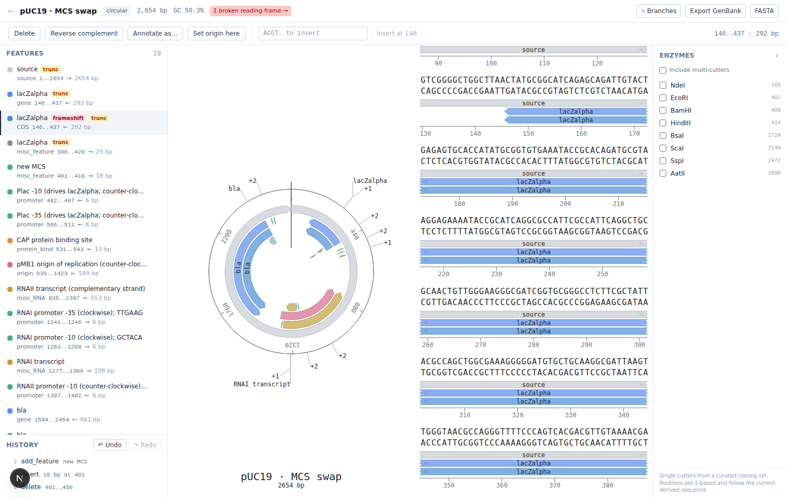

# GitPlasmidos

A web editor for circular DNA sequences (plasmids, 2–20 kb): import GenBank or
FASTA, view the circular and linear maps side by side, edit the sequence, and
undo any of it.


- **Backend** — Python 3.11, FastAPI, Pydantic v2, Biopython, SQLAlchemy 2 + SQLite
- **Frontend** — Next.js 15 (App Router), TypeScript, Tailwind 4, [`seqviz`](https://github.com/Lattice-Automation/seqviz)

> **Just want to run it?** Jump to
> [Running it locally, step by step](#running-it-locally-step-by-step) — a
> complete walkthrough for Windows, macOS and Linux that assumes no
> programming background. The rest of this README explains how the thing works
> and is not needed to use it.

---

## The idea: current state is derived, never stored

This is the part worth understanding first, because everything else follows
from it.

A construct persists exactly three things:

```
base_sequence     the sequence as it was imported, never mutated
base_features     the features as they were imported, never mutated
operations[]      an append-only, ordered log of edits
```

The sequence you see on screen is not in the database. It is computed on every
read by folding the log over the base:

```python
# backend/app/domain/replay.py
def replay(base_seq, base_features, ops, *, is_circular=True) -> ConstructState
```

`replay()` is a pure function — no I/O, no FastAPI, no SQLAlchemy — so the
interesting logic is testable in isolation, and it is where every coordinate
rule lives.

**Why bother?** Three things fall out for free:

1. **Undo is a boolean.** `POST /undo` flips `reverted = true` on the last live
   operation. The next read simply skips it. Nothing is recomputed by hand and
   nothing can drift, because there is no stored state to drift from. Redo
   flips it back.
2. **The history is auditable.** `GET /history` is the literal list of edits,
   including the undone ones. Nothing is lost to an in-place mutation.
3. **The rebasing rules have exactly one home.** Every coordinate shift lives in
   `replay.py` and is exercised by unit tests that never touch a database.

The one thing to be careful about: applying a new operation while some are
undone **deletes** the undone ones. That is text-editor semantics, not git —
there is no branching history.

```
ops:  [0 insert] [1 delete] [2 revcomp]
undo x2                     ↓ reverted    ↓ reverted
apply "insert"              ✗ deleted     ✗ deleted   [1 insert]  ← new
```

### Operations

| kind             | payload                    | notes                                     |
|------------------|----------------------------|-------------------------------------------|
| `insert`         | `{pos, seq}`               |                                           |
| `delete`         | `{start, end}`             |                                           |
| `replace`        | `{start, end, seq}`        | implemented as delete + insert            |
| `revcomp_region` | `{start, end}`             |                                           |
| `add_feature`    | `{feature}`                |                                           |
| `remove_feature` | `{feature_id}`             |                                           |
| `update_feature` | `{feature_id, patch}`      |                                           |
| `set_origin`     | `{pos}`                    | rotates a circular construct              |
| `suppress_finding`   | `{rule_id, feature_id, reason, window, rule_digest}` | silences one design-rule finding |
| `unsuppress_finding` | `{rule_id, feature_id}`    | lets it speak again                       |

---

## Coordinates

0-based, `start` inclusive, `end` exclusive — Python slice semantics.

On a **circular** construct an interval may cross the origin, in which case
`start > end` (e.g. `start=4900, end=120` on a 5000 bp plasmid). `start == end`
means the whole molecule. Zero-length features are rejected.

### How rebasing works

Every length-changing edit moves the features after it. The rules, all covered
one-by-one in `tests/test_rebasing.py`:

**insert at `pos`** — one endpoint rule handles every case, wraparound included:

- `start` moves when `start >= pos` (the insert lands before the feature)
- `end` moves when `end > pos` (the insert lands before the feature's last base)

A feature that strictly contains `pos` therefore keeps its start and grows its
end: it swallows the inserted bases.

**delete `[start, end)`**

- feature entirely inside the range → dropped, with a warning
- feature entirely downstream → both endpoints move back
- feature partially overlapped → clipped to the border and flagged `truncated`

**revcomp_region `[start, end)`** — contained features flip strand and mirror
within the range (`new_start = start + (end - old_end)`). A feature that only
partially overlaps the range is left untouched and reported as a warning: there
is no honest single interval for it afterwards.

**set_origin(pos)** — every coordinate moves by `-pos` modulo the length.

### Wraparound is handled by decomposition, not special cases

A possibly-wrapping interval is split into its one or two **linear** segments
(`circular.py: segments()`), the plain linear rule runs on each, and the pieces
are rejoined (`recombine()`). That keeps one implementation of each rule
instead of a linear and a circular variant.

Operations whose *range* wraps are handled by rotating the construct so the
range starts at 0, applying the linear operation, and rotating back — so
`revcomp_region(4900, 120)` leaves every base outside the range at exactly the
coordinate it had before.

Pattern and enzyme searches concatenate `seq + seq[:k-1]` and drop hits that
start past the end, so a site spanning the origin is found exactly once.

---

## Running it locally, step by step

This section assumes you have never started a program from a terminal before.
Nothing here requires you to write code — you copy a line, press Enter, and
read what comes back. Budget about 20 minutes the first time, and under a
minute every time after that.

**What you are about to run.** The repository you are about to download is
called **GitPlasmidos**; the application inside it is called **visorADN**, and
it is two programs that talk to each other on your own machine:

| | What it is | Where it lives while running |
|---|---|---|
| **The backend** | The engine: it holds the sequences, applies edits, runs the design rules. No window, just text in a terminal. | `http://localhost:8000` |
| **The frontend** | The page you actually look at and click. | `http://localhost:3000` |

`localhost` means *this computer*. Both programs run on your machine, the
sequences you import stay in a single file on your disk
(`backend/visoradn.db`), and nothing is uploaded anywhere. You need the
internet only for the installation steps below — after that it works offline.

Each program runs in its own terminal window, and **that window has to stay
open** the whole time you are using visorADN. Closing it stops the program.
This is normal and is how nearly all development tools work.

---

### Step 1 — Install the three tools you need (once)

| Tool | Why | Do you already have it? |
|---|---|---|
| **Git** | Downloads the code from GitHub and keeps it updatable. | Often preinstalled on macOS and Linux. |
| **uv** | Runs the backend. It also installs the correct Python (3.11+) for you, so **you do not need to install Python yourself**. | Probably not — install it. |
| **Node.js + pnpm** | Runs the frontend. Node is the engine; pnpm installs the frontend's libraries. | Probably not — install both. |

Pick your operating system below and run the commands one at a time, waiting
for each to finish before starting the next.

#### Windows 10 / 11

Open **PowerShell**: press the Windows key, type `powershell`, press Enter. A
blue or black window with a blinking cursor appears — that is the terminal.

```powershell
winget install --id Git.Git -e
winget install --id OpenJS.NodeJS.LTS -e
winget install --id astral-sh.uv -e
```

**Now close PowerShell completely and open it again.** Newly installed tools
are only visible to terminal windows opened *after* the installation — this is
the single most common reason a command "does not exist" five minutes after
you installed it.

Then install pnpm:

```powershell
npm install -g pnpm@10.33.0
```

<details>
<summary>If <code>winget</code> is not available on your machine</summary>

Download and run the installers by hand instead:

- Git — <https://git-scm.com/download/win> (accept every default)
- Node.js — <https://nodejs.org> (choose the **LTS** version)
- uv — paste this into PowerShell:
  ```powershell
  powershell -ExecutionPolicy ByPass -c "irm https://astral.sh/uv/install.ps1 | iex"
  ```

Then reopen PowerShell and run `npm install -g pnpm@10.33.0`.
</details>

> If you already use WSL (Windows Subsystem for Linux), you can ignore all of
> the above and follow the **Linux** instructions inside your WSL terminal
> instead. Do not mix the two.

#### macOS

Open **Terminal**: press <kbd>⌘</kbd> + <kbd>Space</kbd>, type `terminal`,
press Enter.

```bash
xcode-select --install                          # Git and friends; skip if it says already installed
curl -LsSf https://astral.sh/uv/install.sh | sh # uv
```

For Node.js, either download the **LTS** installer from <https://nodejs.org>
and double-click it, or, if you already use [Homebrew](https://brew.sh):

```bash
brew install node
```

Then close the Terminal window, open a new one, and install pnpm:

```bash
npm install -g pnpm@10.33.0
```

#### Linux

Open a terminal (on most desktops: <kbd>Ctrl</kbd> + <kbd>Alt</kbd> +
<kbd>T</kbd>).

```bash
# Debian / Ubuntu / Mint
sudo apt update && sudo apt install -y git curl

# Fedora:        sudo dnf install -y git curl
# Arch / Manjaro: sudo pacman -S --needed git curl
```

```bash
# uv (installs its own Python — nothing else to do for the backend)
curl -LsSf https://astral.sh/uv/install.sh | sh
```

```bash
# Node.js 20 or newer, Debian/Ubuntu:
curl -fsSL https://deb.nodesource.com/setup_22.x | sudo -E bash -
sudo apt install -y nodejs

# Fedora:        sudo dnf install -y nodejs
# Arch/Manjaro:  sudo pacman -S nodejs npm
```

Close the terminal, open a new one, then:

```bash
sudo npm install -g pnpm@10.33.0
```

---

### Step 2 — Check that all four tools answer

In a **freshly opened** terminal, run these four lines. Each should print a
version number:

```bash
git --version     # git version 2.43.0        (any 2.x is fine)
uv --version      # uv 0.8.17                 (any recent version is fine)
node --version    # v22.22.2                  (must be v20 or higher)
pnpm --version    # 10.33.0
```

If one of them says *"command not found"* (macOS/Linux) or *"is not
recognized as the name of a cmdlet"* (Windows), that tool did not install or
your terminal is older than the installation. Close every terminal window,
open a new one, and try again. If it still fails, reinstall just that tool.

Do not continue until all four print a version. Every later step depends on it.

---

### Step 3 — Download the code

The code lives in a **private** GitHub repository called **GitPlasmidos**, so
two things have to be in place before anything below works:

1. **A GitHub account.** Free, at <https://github.com/signup>.
2. **That account added to the repository.** Ask its owner to add you as a
   collaborator — you cannot do this yourself. Until it is done, the command
   below fails with *"Repository not found"*. GitHub says that instead of
   *"you are not allowed"* on purpose, so do not read it as a typo on your
   side: a private repository you cannot see is indistinguishable from one
   that does not exist.

Then pick where the project should live — your home folder is fine:

```bash
cd ~                 # Windows PowerShell: cd $HOME
git clone https://github.com/StefaNovaliere/GitPlasmidos.git
cd GitPlasmidos
```

Because the repository is private, Git asks you to prove who you are. This
happens once:

- **Windows** — a browser window opens. Sign in to GitHub, approve, and Git
  remembers it from then on.
- **macOS / Linux** — you are asked for a *username* and a *password*. The
  username is your GitHub username. The **password is not your GitHub
  password**: GitHub stopped accepting those in 2021. Generate a token at
  <https://github.com/settings/tokens> (*Generate new token (classic)* → tick
  the **repo** checkbox → *Generate token*), copy it, and paste it at the
  password prompt. Nothing appears on screen while you paste — that is
  deliberate, not a frozen terminal. Save the token somewhere safe; GitHub
  shows it exactly once. On macOS it is then stored in your Keychain
  automatically; on Linux, `git config --global credential.helper store` saves
  it for next time, in a plain-text file in your home folder.

You now have a folder called `GitPlasmidos` containing `backend/`, `frontend/`
and `docs/`. The folder and the application have different names — the
repository is *GitPlasmidos*, the program inside it presents itself as
*visorADN*. Nothing is wrong. Confirm you are inside the folder:

```bash
ls                   # Windows PowerShell also accepts ls
# backend  docs  frontend  README.md
```

> **Prefer not to use Git at all?** With your browser signed in to a GitHub
> account that has access, open the repository page, click the green **Code**
> button → *Download ZIP*, unzip it, and `cd` into the unzipped folder — it
> will be called `GitPlasmidos-main`. Everything else in this guide works the
> same; only updating to a newer version later is less convenient.

---

### Step 4 — Start the backend (terminal 1)

From inside the `GitPlasmidos` folder:

```bash
cd backend
uv sync
```

`uv sync` downloads Python and the backend's libraries into `backend/.venv`.
**The first run takes one to three minutes** and prints a long list of package
names. It is silent for stretches — that is normal, let it finish. Later runs
take about a second.

Now start the server:

```bash
uv run uvicorn app.main:app --reload --port 8000
```

You should see something close to:

```
INFO:     Will watch for changes in these directories: ['.../GitPlasmidos/backend']
INFO:     Uvicorn running on http://127.0.0.1:8000 (Press CTRL+C to quit)
INFO:     Application startup complete.
```

**Leave this window open and untouched.** It looks like it has frozen; it has
not — it is waiting for requests, and it will print a line each time the app
asks it for something.

To confirm it works, open <http://localhost:8000/api/health> in your browser.
It should show `{"status":"ok"}`. The full interactive API documentation is at
<http://localhost:8000/docs>.

---

### Step 5 — Load the demo plasmids (terminal 2)

Open a **second** terminal window — do not reuse the first one, the backend is
using it. (Windows Terminal: <kbd>Ctrl</kbd> + <kbd>Shift</kbd> + <kbd>T</kbd>
for a new tab. macOS Terminal: <kbd>⌘</kbd> + <kbd>N</kbd>.)

```bash
cd ~/GitPlasmidos/backend   # Windows PowerShell: cd $HOME\GitPlasmidos\backend
uv run python -m app.seed --reset
```

This creates six constructs — wild-type pUC19 plus five branches — and prints
a run sheet: every scenario worth showing, in order, with its URL already
resolved and one sentence saying what to click. A demo typed from memory is a
demo that goes wrong in front of the person you wanted to impress.

```
Demo, in order:

  1. pUC19
     http://localhost:3000/constructs/9672eea0-…
     Nothing to click yet. The circular map, the 18 features and the single
     cutters in the enzyme panel are all derived from the operation log —
     which holds exactly two entries, and neither is an edit. […]

  2. pUC19 · AmpR +Phe
     http://localhost:3000/constructs/e53d95a5-…
     Branches → Merge "pUC19 · AmpR +Cys". Refused: the two clean codons read
     across a boundary as a stop, and beta-lactamase dies at residue 163 of
     289. The dialog shows all three reading frames as codons.

  3. pUC19 · RBS spacer (lab A)
     http://localhost:3000/constructs/1c0ad519-…
     Branches → Merge "pUC19 · RBS spacer (lab B)". Refused by a design rule
     this time: 8 + 3 + 3 puts the Shine-Dalgarno 14 nt from the ATG […]
```

Keep that output on screen — you will follow it in step 7. The identifiers are
generated fresh on your machine, so they will not match the ones printed here.

`--reset` deletes every existing construct first. Without it the command is
idempotent: running it again restores whatever is missing and leaves the rest
alone. Constructs can be deleted from the listing in the app, and re-seeded
from here.

---

### Step 6 — Start the frontend (same terminal 2)

Still in terminal 2, the seeding is done, so you can reuse it:

```bash
cd ../frontend              # or: cd ~/GitPlasmidos/frontend
pnpm install
pnpm dev
```

`pnpm install` takes about a minute the first time. Then `pnpm dev` prints:

```
   ▲ Next.js 15.5.25
   - Local:        http://localhost:3000

 ✓ Ready in 1596ms
```

**Leave this window open too.** You now have two terminals running: the
backend in one, the frontend in the other. That is the normal working state.

---

### Step 7 — Open it and take the tour

Go to <http://localhost:3000> in your browser (Chrome, Firefox, Edge and
Safari all work).

The first time you open a page it may take five to ten seconds and the tab
will look stuck — Next.js is compiling that page on demand in development
mode. Subsequent visits are instant.

Then follow the run sheet from step 5, in order:

1. **pUC19** — the circular and linear maps, 18 features, single cutters in the
   enzyme panel. The findings panel reads *"2 findings, 2 suppressed"*, and the
   reason each was suppressed is in the history, where it can be read, undone
   or disagreed with.
2. **pUC19 · AmpR +Phe** → *Branches → Merge "pUC19 · AmpR +Cys"*. Two branches
   that are each perfectly fine alone; merged, the two inserted codons read
   across a boundary as a stop and beta-lactamase dies at residue 163 of 289.
   The merge is refused and the dialog shows all three reading frames as codons.
3. **pUC19 · RBS spacer (lab A)** → *Branches → Merge "…(lab B)"*. Refused by a
   design rule instead: the two spacer insertions add up to a
   Shine-Dalgarno-to-ATG distance nothing will translate well from.
4. **pUC19** → *Branches → Compare* against the MCS swap. One replaced block,
   one added annotation, four genuinely truncated features, and fourteen that
   merely shifted, reported apart.


---

### Stopping, and starting again tomorrow

To stop either program, click its terminal window and press
<kbd>Ctrl</kbd> + <kbd>C</kbd> (on macOS too — <kbd>Ctrl</kbd>, not
<kbd>⌘</kbd>). Do that in both windows. Nothing is lost: your constructs live
in `backend/visoradn.db` on disk.

Starting again is four lines, no installation:

```bash
# terminal 1
cd ~/GitPlasmidos/backend && uv run uvicorn app.main:app --reload --port 8000

# terminal 2
cd ~/GitPlasmidos/frontend && pnpm dev
```

On Windows PowerShell, `&&` works the same in recent versions; if it complains,
just run the two halves as separate lines.

To pick up a newer version of the code later:

```bash
cd ~/GitPlasmidos
git pull
cd backend && uv sync && cd ../frontend && pnpm install
```

---

### If something goes wrong

| What you see | What it means | What to do |
|---|---|---|
| `command not found` / `is not recognized as the name of a cmdlet` | The terminal was opened before the tool was installed, or the tool is missing. | Close **every** terminal window, open a new one, retry. Then reinstall that tool (step 1). |
| `git clone` says `repository not found` | Almost never a typo: the repository is private and the GitHub account you authenticated with has not been given access. | Ask the owner to add your account as a collaborator, then retry (step 3). |
| `git clone` says `Authentication failed` or keeps asking for a password | Your GitHub *password* was typed at the password prompt. GitHub does not accept it. | Paste a personal access token instead (step 3). |
| `[Errno 48] Address already in use` / `error while attempting to bind on address` | Something else is already using port 8000 (often a forgotten copy of this backend). | Find and stop it — see below — or run the backend on another port (see *Settings*). |
| `⚠ Port 3000 is in use, using 3001 instead` | Same thing on the frontend side. Next.js moved by itself. | Fine, but the backend only trusts port 3000 by default. Either free port 3000, or set `CORS_ORIGINS` (see *Settings*). |
| The page loads but every panel says *"Failed to fetch"* or *"Could not reach the API"* | The frontend is running, the backend is not. | Check terminal 1. If it exited, start it again (step 4) and reload the page. |
| The listing is empty | The database has no constructs yet. | Run the seed command from step 5. |
| `uv sync` or `pnpm install` stops with a network/TLS error | No internet, or a corporate proxy/firewall is intercepting downloads. | Retry on a different network, or ask IT to allow `pypi.org`, `astral.sh` and `registry.npmjs.org`. |
| Windows: *"running scripts is disabled on this system"* | PowerShell's execution policy blocks the uv install script. | Use the `winget` command instead, or the `powershell -ExecutionPolicy ByPass -c …` form given in step 1. |
| macOS: *"cannot be opened because the developer cannot be verified"* | Gatekeeper blocking a downloaded installer. | *System Settings → Privacy & Security → Open Anyway*, or install via Homebrew instead. |
| The app behaves oddly after an interrupted edit, or you want a clean slate | Local database state. | Stop the backend, delete `backend/visoradn.db`, start it again, re-run the seed command. |
| `pnpm dev` fails with an error mentioning an unsupported Node version | Node is older than 20. | Install the current **LTS** from <https://nodejs.org> and check with `node --version`. |

**Freeing a busy port** (replace `8000` with `3000` as needed):

```powershell
# Windows PowerShell
netstat -ano | findstr :8000      # last column is the process id (PID)
taskkill /PID 12345 /F
```

```bash
# macOS / Linux
lsof -i :8000                     # second column is the PID
kill 12345
```

---

### Settings you can change

None of these are needed for normal use. Set them in the terminal *before* the
command that starts the program.

| Variable | Belongs to | Default | What it does |
|---|---|---|---|
| `DATABASE_URL` | backend | `sqlite:///backend/visoradn.db` | Where constructs are stored. |
| `CORS_ORIGINS` | backend | `http://localhost:3000,http://127.0.0.1:3000` | Which browser origins may call the API. Widen it if the frontend runs on another port. |
| `NEXT_PUBLIC_API_BASE_URL` | frontend | `http://localhost:8000` | Where the UI looks for the API. |

```bash
# macOS / Linux
NEXT_PUBLIC_API_BASE_URL=http://localhost:8001 pnpm dev
```

```powershell
# Windows PowerShell
$env:NEXT_PUBLIC_API_BASE_URL = "http://localhost:8001"
pnpm dev
```

The backend port is a flag rather than a variable:
`uv run uvicorn app.main:app --reload --port 8001`. If you change either port,
change the matching setting on the other side as well — otherwise the two
programs stop finding each other, which shows up as *"Failed to fetch"*.

A production-style build of the frontend (faster pages, no on-demand
compiling, no live reload) is `pnpm build` followed by `pnpm start`.

---

### About the demo scenarios

Both merge refusals are asserted in `tests/test_seed.py` — each branch clean on
its own, the merge blocked for the reason the run sheet claims — so the demo
cannot quietly stop demonstrating anything.

The AmpR pair is the one to read closely. Two teams each insert a single codon
into the beta-lactamase gene at the same site: one adds a phenylalanine, the
other a cysteine. Each branch alone yields a full-length 287-residue protein
with no reading-frame problem. Their inserts are single points, so they cannot
overlap, and both are 3 bp, so neither shifts the frame — a text merge, or a
CRDT over the sequence, reports success. Merged, the two codons read across a
codon boundary as a stop, and AmpR dies at residue 163 of 289. The merge is
refused with a 409 naming the codon. That pair was found by search rather than
by hand: `app/seed.py` records the positions.

#### The first screen is two suppressed findings, on purpose

Wild-type pUC19 trips `rbs-atg-spacing` on both of its genes: neither carries
the strong AGGAGG consensus, and both are transcribed anyway. The rule is not
wrong about what it measures, so it stays an `error` — softening a rule to make
a demo look good is how a linter stops meaning anything.

What is a judgement is that *this* molecule is fine regardless, so the seed
records that judgement the way the application would: two `suppress_finding`
operations on the wild type, with a reason attached. The demo opens on
*"2 findings, 2 suppressed"* instead of on two red errors that make the linter
look broken, and the very first thing on screen is the mechanism this project
is about — an imperfect rule, a documented human decision, and both of them
still visible.

They are computed, never hardcoded: a suppression carries the digest of the
window its rule read, so it can only be built by asking the engine what it
just looked at. Step 3 of the run sheet then shows the other half of that — the
two labs replace the bases the wild-type decision was made about, so it stops
covering them and the merge dialog says so, quoting both readings.

---

### Tests

```bash
cd backend
uv run pytest
```

512 tests: one per rebasing rule, explicit wraparound cases, GenBank round
trips against two real pUC19 records, reading-frame integrity, log merging,
design rules and their suppressions, both merge gates, the seeded scenarios,
and the HTTP surface end to end. They need neither server to be running.

The frontend has no test suite; `pnpm typecheck` type-checks it.

---

## API

| Method | Path                                | |
|--------|-------------------------------------|-|
| POST   | `/api/constructs`                   | create empty or from a raw sequence |
| POST   | `/api/constructs/import`            | multipart `.fasta` / `.gb` / `.gbk` |
| GET    | `/api/constructs`                   | listing |
| GET    | `/api/constructs/{id}`              | metadata + current derived state |
| DELETE | `/api/constructs/{id}`              | |
| POST   | `/api/constructs/{id}/operations`   | apply one operation |
| POST   | `/api/constructs/{id}/undo`         | |
| POST   | `/api/constructs/{id}/redo`         | |
| GET    | `/api/constructs/{id}/history`      | operations with their `reverted` flag |
| GET    | `/api/constructs/{id}/export`       | `?format=genbank\|fasta` |
| GET    | `/api/constructs/{id}/enzymes`      | `?all=true`, `?names=EcoRI,BamHI` |
| GET    | `/api/constructs/{id}/orfs`         | `?min_length=300` |
| POST   | `/api/constructs/{id}/branch`       | fork, carrying base and history |
| GET    | `/api/constructs/{id}/branches`     | branches and how far ahead each is |
| POST   | `/api/constructs/{id}/merge/preview`| what a merge would do |
| POST   | `/api/constructs/{id}/merge`        | rebase a branch's log onto this one |
| GET    | `/api/constructs/{id}/diff`         | `?against={id}` — sequence, features, operations |

`GET /{id}` returns `sequence`, `features`, `length`, `is_circular`,
`gc_content`, `warnings`, `frame_issues`, `can_undo` and `can_redo`.

Warnings are part of the derived state: they are recomputed on every replay,
so undoing a truncating delete makes its warning disappear along with the
truncation.

`/enzymes` returns single cutters from a curated set of ~57 cloning workhorses
by default; `?all=true` widens to every commercially available enzyme and
includes multi-cutters. `/orfs` scans all six frames with the standard genetic
code (NCBI table 1) and, on a circular construct, finds ORFs that run through
the origin.

---

## Reading-frame integrity

Rebasing coordinates correctly is not the same as keeping a construct
*biologically* valid. Delete one base inside a CDS and every coordinate in the
system stays perfectly consistent — while the protein is gone.

`analysis.check_reading_frames(state)` runs over the derived state and reports
each coding feature that no longer makes a protein:

| problem | severity | |
|---|---|---|
| `frameshift` | error | length is not a multiple of 3 |
| `premature_stop` | error | an in-frame stop before the last codon |
| `no_stop_codon` | warning | the last codon is not a stop |
| `no_start_codon` | info | does not begin ATG/GTG/TTG |



The two `error` cases are marked `blocking`. They appear in `GET /{id}` as
`frame_issues`, and the UI badges the offending feature. Being derived, they
vanish on undo exactly like a truncation flag does.

Deliberately *not* inside `replay()`: replay owns coordinates, this owns
meaning. Keeping them apart is what lets the same function gate a branch merge
over the same derived state - see below.

### Why the origin-crossing case is the whole difficulty

A CDS that wraps the origin has its codons assembled from two segments, and
**the codon straddling position 0 belongs to neither of them**. For a 30 bp CDS
at `[32, 2)` on a 60 bp plasmid, the tail is 28 bases and the head is 2 —
neither is a multiple of 3, though the CDS is perfectly in frame. Any
implementation that translates the segments separately reports a frameshift on
a healthy gene *and* misses a real stop codon spanning the origin.

`coding_sequence()` therefore assembles the whole span first, then reverse
complements it if the feature is on the minus strand, and only then translates.

`tests/test_reading_frame.py` builds its fixtures by construction rather than
from hand-computed coordinates: a CDS with a known protein is placed in a
plasmid, and `set_origin` rotates the molecule until the stop codon's three
bases land on positions 59, 0 and 1. The suite's backbone is a property test
sweeping all 59 non-trivial origins and asserting the verdict never changes —
rotating a plasmid cannot make a gene valid or invalid. Four deliberately
broken implementations (naive slice, per-segment translation, ignored strand,
off-by-one on the terminal stop) were each checked to fail it.

---

## Branching and merging

A branch is just a construct that shares its parent's base and the first
`fork_index` of its operations. That makes every existing endpoint work on it
unchanged - a branch can be viewed, edited, undone and exported like anything
else.

Merging is a **rebase of the operation log**. Because the history is a list of
semantic operations rather than a blob of text, the branch's operations can be
re-expressed against the target's tip:

```
                  ancestor
                 /        \
   target adds  P0 P1     B0 B1  adds branch
                 \        /
         target + P0 P1 + B0' B1'      B' = B rebased through P
```

Rebasing `delete [1000, 1100)` through a preceding `insert(pos=0, 4 bp)` gives
`delete [1004, 1104)` - the same endpoint arithmetic `replay()` uses to move
*features* across an edit, turned ninety degrees to move *operations*.

### Three independent ways a merge can fail

**Coordinate conflicts.** The two branches touched the same bases. Reported
exactly as a text merge reports overlapping hunks, and not forceable - undo one
side, or redo the edit against the merged sequence.

**Biological breakage.** This is the interesting one. Two edits can be
perfectly non-overlapping, merge cleanly at the coordinate level, and still
destroy the protein:

```
ancestor CDS   ATG CCC CCC CCC CCC TAA        M P P P P *
target   +CCT  ATG CCC TCC CCC CCC CCC TAA    M P S P P P *   fine
branch   +AAG  ATG CAA GCC CCC CCC CCC TAA    M Q A P P P *   fine
merged         ATG CCC TAA GCC CCC ...        M P *           gone
```

Both inserts are 3 bp, so neither shifts the frame, and both are single points,
which cannot overlap. A text merge - or a CRDT over the sequence - reports
success. Running `check_reading_frames()` over the merged state catches it, and
the merge is refused with a 409 naming the codon.

Only damage the merge *introduces* counts: problems already present on either
tip are not blamed on it. And the refusal is overridable with
`allow_frame_breaks`, because deliberately building a frameshift mutant is real
work - blocking by default is the point, blocking absolutely would be
paternalistic.

**A design rule the merge lands on.** The same shape of failure one level up.
Two branches each move a ribosome binding site three bases further from its
start codon; 8 nt becomes 11 either way, still inside the window the literature
gives. Merged, it is 14, and outside it. Nobody broke anything, the merge did,
and a rule of severity `error` refuses it — with the same "only what the merge
introduces" rule as above.

This gate has no override flag. The confidence behind an `error` was already
checked when the rule was loaded, so nothing can declare itself blocking on a
number nobody measured; what gets through instead is a *decision*, recorded as
a `suppress_finding` in the merge commit with a reason attached. See
[Suppression is an edit](#suppression-is-an-edit-not-metadata).

### One refusal, every reason

A merge has to clear both gates, and clearing one only to be refused by the
other is worse than being told everything at once. So the 409 carries all of
it — conflicts, frame damage, rule findings, and the pack that judged them —
and the dialog settles both in one request: a checkbox for the frameshift, a
written reason per blocking finding, one `POST` carrying
`allow_frame_breaks` and the suppressions together.

The two acknowledgements stay different on purpose. A frameshift mutant is
real work somebody may be doing deliberately, so that gate takes a click. A
design-rule error takes a sentence, because that sentence goes into the log.

### Showing the damage, not just naming it


A 409 with a message is not an explanation. The refusal opens a three-track
view at codon resolution — each branch, then the projected merge — aligned on
the codon that broke. Both branches read `… D R [F|C] W E P E …`; the merge
reads `… D R * F W E …` at the same position. That is the whole argument, on
one screen.

Two things make it possible. The frame check reports the break in **genomic**
coordinates (`stop_start`, `translated_start`, …), not just a codon number, so
a viewer can point at it without re-deriving anything; for a gene on the minus
strand, like `bla`, that means translating a codon index backwards through the
feature. And the merge preview returns the sequence *and* the rebased features
it would produce, so the projected track is read in the gene's own frame rather
than guessed at.

On the map, a gene a premature stop has cut in half is drawn as two
annotations: the part that still makes protein in its own colour, the 126
codons downstream of the stop at a quarter alpha, and the stop codon itself
under a red highlight.

SeqViz has no way to inject a custom glyph, so the close-up is a
purpose-built codon track rather than a fight with the library; at thirty
bases it is the clearer rendering anyway. It *can* be navigated, though: a
`selection` passed as a prop rather than made by dragging scrolls the linear
viewer to it. The red badge in the header uses that — clicking it selects the
ruined feature, scrolls the viewer to it, and brings its row into view. A
premature stop has one codon to blame and the badge goes straight to it; a
frameshift has none, because the frame is wrong from the indel onwards, so it
goes to the feature instead.

The prop is set briefly and then cleared: leaving it in place would override
the user's own selections, since SeqViz treats a supplied selection as
authoritative.

### Why the frame has to be carried

Branch operation *i* is written against the branch state after operations
`0..i-1`, not against the ancestor. Rebasing it through the target's transforms
alone puts it in the wrong place, so the transform chain is carried across each
branch operation as it is applied.
`test_a_second_branch_operation_is_rebased_from_its_own_frame` is the
regression test: without carrying, the second insert lands *inside* the bases
the target inserted rather than in front of the ancestor base it was aimed at.

Operations whose range crosses the origin are decomposed the way `replay()`
applies them - rotate the range to the front, do the linear thing, rotate back -
so a rotation on one side carries the other side's edit around the molecule
without a special case.

A merged branch stops being ahead of its parent. The branch records how many
of its own operations have crossed over, and a second merge carries only the
work done since the first — without that, merging twice replays the branch's
edits on top of themselves and quietly corrupts the construct.

Endpoints: `POST /{id}/branch`, `GET /{id}/branches`,
`POST /{id}/merge/preview` and `POST /{id}/merge`.

---

## Diffing two constructs


`GET /{id}/diff?against={other}` compares two derived states: which bases
differ, which annotations moved, and which operations each side ran since the
fork. It works on any pair, related or not.

Three things make the difference between a diff that is correct and one that
is readable.

**`difflib`'s `autojunk` has to be off.** Its default heuristic discards
elements appearing in more than 1% of positions — which, in a four-letter
alphabet, is every base. Left on, a 2 kb pair differing by a single edit
matches at 0.41 instead of 0.99. There is a test that pins this.

**`difflib` aligns characters, not biology.** Replacing 50 bases with a run of
G's leaves it free to match a stray G either side, reporting three changes
where a reader wants one. Changes separated by fewer than ten matching bases
are coalesced into a single block. The added/removed counts are taken *before*
coalescing, so a base absorbed as context never counts as both.

**A rotation is not a rearrangement.** `set_origin` rewrites every coordinate
without touching the molecule, and a naive diff calls that a total rewrite. The
comparison infers the rotation, normalises it, and reports it as
`origin_shift`. Inferring it is subtler than it looks: anchoring on a probe
from the start fails on repetitive sequence (a probe of `ACGTACGT…` matches at
position 0 of a molecule rotated by any multiple of the period), and the single
longest shared block fails when an edit near the middle splits the molecule and
the larger half votes for a rotation off by the length of the edit. So blocks
vote by length, the top few candidates are each scored, and the one that
actually explains the two sequences best wins. The search only runs when a
change touches an end, which is the only way material can cross the origin —
so the common case, a branch and its parent sharing an origin, costs one
alignment.

### Shifted is not changed

A 30 bp deletion near the origin moves every feature on the plasmid. Listing
all of them as "changed" buries the one that actually was, so features whose
coordinates moved while still covering the same bases are reported separately
as `shifted`. On the screenshot's branch that turns eighteen rows of noise into
one added feature, four genuinely truncated ones, and "14 shifted by edits
upstream".

---

## Design rules

Reading-frame integrity is one check written in Python. Most of what makes a
construct fail is a different shape of question - is the ribosome binding site
the right distance from the start codon, does anything terminate transcription
after the gene, is a promoter on the other strand firing back into it - and
those are questions biologists should be able to add without touching the
engine.

So they are data. A rule is a YAML file:

```yaml
# yaml-language-server: $schema=./rule.schema.json
id: rbs-atg-spacing
severity: error
target: { feature_kind: CDS }
region: { where: upstream, window: 30 }
look:   { motif: AGGAGG, strand: same }
expect: { presence: required, distance_min: 5, distance_max: 13 }
message: "{feature}: Shine-Dalgarno is {distance} nt from the start codon"
message_missing: "{feature}: no Shine-Dalgarno in the {window} bases upstream"
evidence:
  citation: "Shine J, Dalgarno L. PNAS 1974;71(4):1342-6. doi:10.1073/pnas.71.4.1342"
  organism: "Escherichia coli"
  confidence: established
```

`target / region / look / expect` covers all three rules in the shipped pack.
The deliberate limit is that it stops there: position-weight matrices,
thermodynamic binding strength and secondary structure need real computation,
so they belong in Python. Both kinds report the same `Finding` and the engine
does not know the difference - the same split as `replay()` owning coordinates
while `check_reading_frames()` owns meaning.

### Two required fields

`evidence` and `examples` are not optional, and they are the reason this is
worth doing rather than a folder of magic numbers.

A threshold with no citation and no organism is folklore: six months on nobody
can say whether "5-13 nt" was measured in *E. coli* or in yeast. Pydantic
refuses the rule rather than leaving it for a reviewer to catch.

`examples` are sequences that must and must not trigger the rule, and they run
in CI. That is what lets a biologist add a rule and find out whether it is
self-consistent without an engineer reading the biology - the collaboration
runs in parallel instead of queueing behind one person.

`confidence` also caps severity: a `heuristic` rule is refused if it declares
itself an `error`. That is not a style rule — an `error` finding the merge
introduces actually refuses the merge, so a linter that blocked one on a number
nobody measured would get switched off, and it would not come back.

### Two failures, two diagnoses

A motif that is absent and a motif at the wrong spacing are different problems,
and a biologist does different things about them. One template cannot say both:
it would have to interpolate a distance that does not exist. So a rule that can
report an absence writes `message_missing` as well, and Pydantic refuses one
whose `message` interpolates `{distance}` without it — the bug that check
prevents shipped once already, as *"Shine-Dalgarno sequence is ? nt from the
start codon"*.

### Authoring

```bash
uv run python -m app.domain.rules schema     # regenerate rule.schema.json
uv run python -m app.domain.rules check      # validate, and run every example
```

The schema modeline at the top of each file gives autocompletion and inline
errors in any editor with YAML language-server support, which turns writing a
rule into filling a guided form rather than guessing field names.

The engine reuses the wraparound helpers: a search window is an interval that
may cross the origin, and a motif search is what enzyme sites already do.
Motifs are IUPAC-aware, because a consensus written `TTGACR` searched literally
finds nothing. The genuinely error-prone part is direction, and it has two
halves. A rule's region is expressed in the *target's reading direction*, so
"upstream" of a minus-strand gene means higher coordinates — and the motif is
matched on the strand that gene reads, so a ribosome binding site for it reads
`AGGAGG` on the minus strand, which is `CCTCCT` in the plus-strand text.

Getting the second half backwards is the worst kind of bug this project can
have: it accepts exactly the sequences that cannot work and reports the ones
that can, on half the genes in the file, without failing anything. It shipped
that way and was caught while building the demo — on lacZ-alpha, which is on
the minus strand. `rbs-atg-spacing` now carries two minus-strand examples that
are the same molecule read from either side, so the pack itself fails if the
distinction is ever lost again.

### Which pack judged this

A gate whose rules can change on the server without anybody noticing stops
being trusted. So the pack identifies itself: `pack_digest()` hashes every
loaded rule (minus its examples — those are the rules' tests, not the rules),
and that digest travels on every response that carries a finding, shows in the
panel header, and names itself in every refusal.

It is deliberately wider than the per-rule digest. Rewording a message does not
change what a rule *asserts*, so it must not invalidate anybody's suppression —
but it does change what the linter says, so it is not the same pack. Each
suppression records both, which is what separates *"you changed the DNA"* from
*"somebody changed the rules underneath you"*: the rule digest invalidates,
the pack digest explains.

The panel also counts what would not load. A rule that vanishes because of a
YAML typo is a check nobody is running any more, and silence about that is the
same failure as a suppression that disappears quietly.

### Suppression is an edit, not metadata

Every linter needs a way to say "I know, it is deliberate". The tempting place
to put that is a field on the construct — and it would quietly break the one
invariant the whole app rests on. A suppression stored beside the log has no
author, no undo, no place in a diff, and no defined behaviour under merge.

So it is an operation like any other:

```json
{
  "kind": "suppress_finding",
  "payload": {
    "rule_id": "rbs-atg-spacing",
    "feature_id": "lacZalpha",
    "reason": "weak RBS on purpose, we are titrating expression",
    "rule_digest": "9c1f…",
    "window": { "digest": "a3f2…", "excerpt": "AGGAGGTATT", "start": 412, "end": 433 }
  }
}
```

Undo, history, diff and rebase come for free, because they already work on
operations. `reason` is required: a silenced alarm nobody explained is
indistinguishable from one somebody switched off.

**What the digest is over, and what it is not.** `digest` covers the text of
the window the rule read — in the target's *reading direction*, so flipping a
cassette with `revcomp_region` does not invalidate anything — and nothing else.
Coordinates are deliberately outside it. That is what makes the interesting
case work: an insertion a thousand bases upstream moves `start`/`end` without
changing one base the rule looked at, so the suppression stands. The window is
never how a suppression finds its finding either; `(rule_id, feature_id)` is,
and a feature id already survives every coordinate edit. `start`/`end` are
provenance — carried across edits with the same arithmetic features use, so
"suppressed on the window at 412..433" keeps pointing at those bases.

**When the evidence does change**, the finding comes back *marked*, quoting
both readings:

> suppressed when this region read `AGGAGGTATT`; it now reads `AGGAGGTTTT`

Both alternatives are worse. Invalidate silently and people re-suppress after
every nearby edit, which is how a linter gets switched off. Carry it silently
and the suppression ends up covering a problem introduced afterwards. Neither
is acceptable, so a stale suppression is visible and the call goes back to
whoever made it.

**Under merge it can never conflict.** Mapping a window across an edit that
landed inside it has no answer — for an `add_feature` that is a conflict, and
rightly so. A suppression moves no bases: the worst an overlapping edit can do
is invalidate the evidence, which the digest already catches. So the rebase
drops the coordinates instead of refusing the merge, and the finding surfaces
stale on the other side. A note somebody left about a warning should not be
able to block a merge.

**And it is the only door through the merge gate.** The rebase never conflicts
on a suppression, but the *merged state* is still linted: an `error` the merge
introduces refuses it, and a suppression the merge invalidated stops silencing,
so the finding lands in `new_findings` and the merge bounces. The 409 body
carries the finding itself — which rule, whose decision, and both readings of
the window — so the UI needs nothing further to say why:

> **lacZalpha** `rbs-atg-spacing`
> Somebody had already decided this was deliberate — *"weak RBS on purpose, we
> are titrating expression"* — but the bases that decision was made about are
> not these bases any more.
> `when suppressed  AAAAAAAAAAAAAAAAAACCCCCCCCCCCC`
> `after the merge  AAAAAAAAAAAAAAAAAACCCCGGGCCCCC`

Merging then requires a reason per blocking finding, which the endpoint turns
into `suppress_finding` operations appended to the merge commit — computed
against the evidence in the *merged* state, the only place the finding exists.
Both decisions end up in the history, in the order they were taken.

Suppressed findings are marked and counted, never dropped: the panel header
reads *"3 findings, 1 suppressed"*. Hidden ones rot.

---

## Import / export

Import reads the first record of a FASTA or GenBank file (extra records are
reported as a warning), takes circularity from the LOCUS `topology` field, and
names features from `label`, `gene`, `product`, `standard_name` or `note`, in
that order, falling back to the feature type. `join(a..len,1..b)` locations are
rejoined into origin-crossing features. Sequences are validated against
`ACGTN` + the IUPAC ambiguity codes `RYSWKMBDHV`; anything else is a 422.

Import is deliberately forgiving about the rest: the checked-in pUC19 fixture
contains a genuinely malformed location line, and the importer skips just that
feature and says so rather than failing the file.

Export writes the **current** derived state, not the base, and round-trips
sequence, features, strands, colours (via the ApE/SnapGene `ApEinfo_fwdcolor`
qualifier), origin-crossing features and truncation flags. Re-importing an
exported file gives back an equivalent construct — there is a test for it.

---

## Layout

```
backend/
  app/
    main.py
    api/routes/constructs.py   HTTP surface
    api/schemas.py             request/response bodies
    domain/                    ← pure, no I/O
      models.py                Feature, Operation, ConstructState
      replay.py                replay() and every rebasing rule
      circular.py              wraparound helpers
      seqio.py                 Biopython import/export
      analysis.py              enzymes, ORFs, GC, reading frames
      merge.py                 rebasing one operation log onto another
      diff.py                  comparing two derived states
      rules/                   design rules: models, loader, engine, CLI
    db/                        SQLAlchemy models + session
    seed.py                    the demo scenarios
  data/                        two real pUC19 GenBank records
  rules/                       the rule pack, authored in YAML
  tests/
    test_rebasing.py  test_circular.py  test_replay.py  test_seqio.py
    test_analysis.py  test_reading_frame.py  test_merge.py  test_diff.py
    test_seed.py      test_api.py
frontend/
  app/constructs/[id]/page.tsx the editor
  app/page.tsx                 what this is, the scenarios, the listing
  components/                  Toolbar, FeatureList, HistoryPanel,
                               EnzymePanel, SeqVizPane, Toasts
  lib/                         api.ts, types.ts, sequence.ts, useConstruct.ts
```

---

## Notes and deviations from the brief

- **`seqviz` prop name.** The brief said `viewType="both"`; the actual prop in
  seqviz 3.x is `viewer`. Used the real one.
- **`Bio.Restriction.CommonEnzymes` does not exist** in Biopython 1.88. The
  real sets are `AllEnzymes` (1088) and `CommOnly` (623), neither of which
  makes a usable checkbox list, so `/enzymes` defaults to a curated set of
  cloning workhorses defined in `analysis.py` and `?all=true` widens to
  `CommOnly`.
- **`Feature.truncated`** was added to the model so the flag the brief asks for
  can travel through the API and be shown in the UI.
- **`replay()` takes `is_circular`** as a keyword argument. The signature in
  the brief has no way to know the topology, and every rebasing rule needs it.
- **`create-next-app` installs Next 16**; pinned back to 15 as specified.
- **pUC19 fixtures came from GitHub, not NCBI.** `eutils.ncbi.nlm.nih.gov` is
  blocked by this environment's egress policy, so accession L09136 could not be
  fetched directly. `backend/data/` holds two equivalent 2686 bp pUC19
  records mirrored from public repositories; see the README there.
- **Optimistic UI is sequence-only.** Edits show the predicted sequence
  immediately and roll back if the POST fails, but feature positions come from
  the server. Re-implementing the rebasing rules in TypeScript to predict them
  client-side would fork the one thing this project is trying to get right.
- **The pack digest is recorded on suppressions, not on every operation.**
  Each suppression stores the pack it was decided against, so a finding can say
  *"the rules moved underneath you"*. Saying the same about an ordinary edit —
  *"the pack changed between your last two edits"* — would mean carrying the
  digest on every operation in the log, which is real weight on 99% of payloads
  for a warning that today only applies to suppressions. Left as documented
  debt.
- No authentication, no multi-user — as specified.
